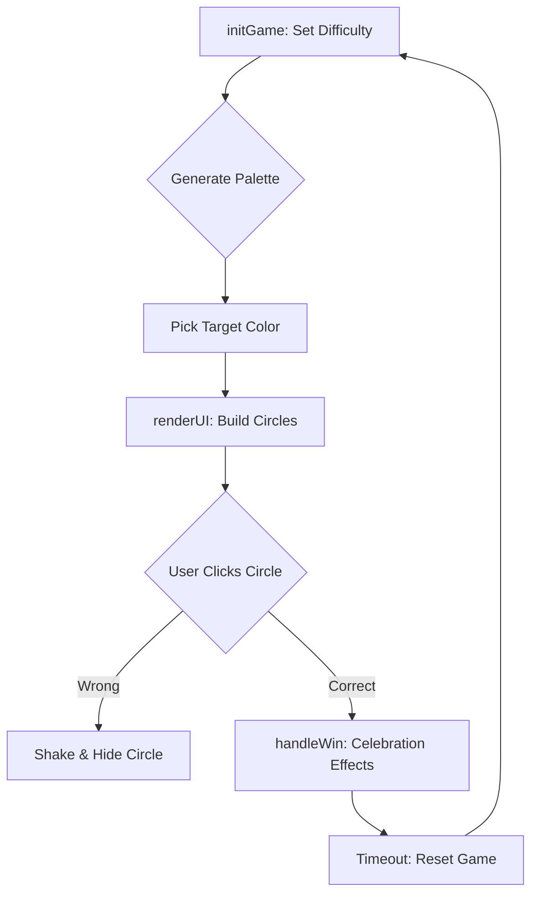

# RGB Color Guessing Game

---

[RGB game ⚪](https://axlgoze.github.io/RGB-game/)

A vibrant, interactive web application that challenges users to identify a specific color based on its RGB (Red, Green, Blue) numerical values. The project provides a gamified way to learn how digital colors are composed, featuring a sleek, minimalist aesthetic with smooth CSS animations and a "Single Source of Truth" state management pattern.

**Languages**: HTML5, CSS3, JavaScript

## Architecture

Core Components
| File/Class | Primary Responsibility | Key Inputs/Outputs |
| :--- | :--- | :--- |
| `gameState` | Maintains the "Single Source of Truth" (difficulty, colors, game status). | **In:** User interaction / **Out:** UI State |
| `Utils` |Logic for random RGB generation and palette array creation. | **In:** Count / **Out:** Array of RGB strings |
| `VisualEffects` | Orchestrates win animations (celebration, pulse, and color flashes). | **In:** DOM Elements / **Out:** Visual CSS changes |
| `renderUI` | Syncs the DOM with the current state of gameState. | **In:** State object / **Out:** Rendered HTML |

### Installation & Usage
Installation
Clone the repository:

Bash
git clone https://github.com/user/rgb-game.git
Navigate to the folder:

Bash
cd rgb-game
Launch:
Open the index.html file in any modern web browser.

### Usage
1. Select a difficulty (Easy = 3 colors, Hard = 6 colors).

2. Read the RGB code displayed in the header (e.g., rgb(255 0 0)).

3. Click the circle you believe matches that code.

If you win, enjoy the celebration effect before the game automatically resets!

<b>Click to see Game Rules</b>

Easy Mode: 3 color options.

Hard Mode: 6 color options.

Incorrect Guess: The circle fades away and shakes.

Correct Guess: The entire background changes to the winning color and the game resets after 3 seconds.

### Design

- Decoupled Logic: Utilities and Visual Effects are isolated in objects (Utils, VisualEffects) to improve maintainability.

- Event Delegation: The colorsDiv handles clicks for all circles, reducing the number of event listeners and improving performance.

- BEM Naming: CSS follows the Block-Element-Modifier convention for predictable styling.

### Roadmap:

- [ ] Implement a "Score Streak" counter to track consecutive wins.

- [ ] Implement a "Custom Mode" where users can choose the number of circles.

- [ ] Add Sound Effects for "Correct" and "Wrong" guesses.
 
- [ ] Refactor into a Component-based structure (e.g., Web Components).

### Contribution & Testing
### How to Contribute
We prioritize Clean Code and Readability.

Ensure all new functions are documented with JSDoc comments.

Use BEM (Block Element Modifier) naming conventions for any new CSS classes.

Keep the global namespace clean by encapsulating new logic within specific modules or functions.

### Testing
Currently, testing is performed manually:

Open the browser console.

Verify that gameState updates correctly after each click.

Ensure the shake animation triggers only on incorrect guesses.

### Lessons Learned (Educational Log)
Hardest Part: Managing the timing between the celebrationEffect and the automatic game reset to ensure the UI didn't flicker or break the state transition.

Main Takeaway: Using a centralized gameState object makes debugging significantly easier than tracking variables scattered throughout the script.

---
### About me
[linkedin](https://www.linkedin.com/in/axel-reyes-wd/)