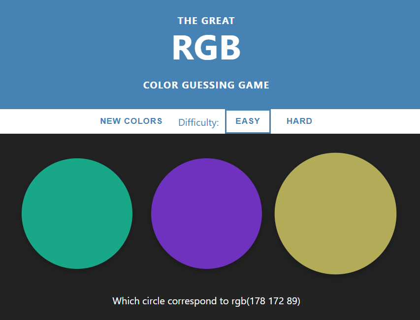
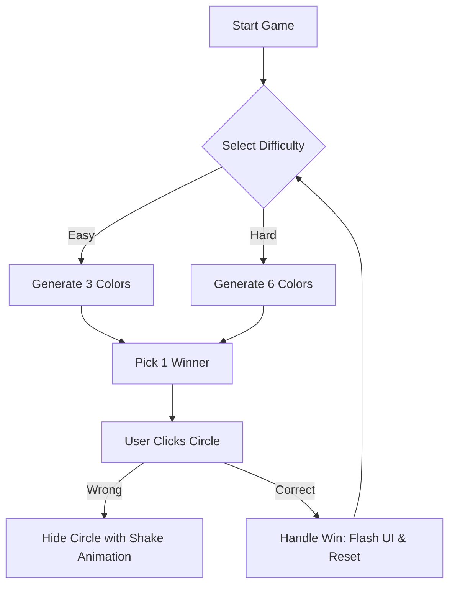

# RGB Color Guessing Game

---

[RGB game ⚪](https://axlgoze.github.io/RGB-game/)

A vibrant, interactive web-based puzzle that challenges users to identify the correct color based on RGB (Red, Green, Blue) numerical values. The project provides an engaging way to learn how digital colors are composed while maintaining a clean, responsive UI with smooth animations and dynamic difficulty scaling.

**Languages**: HTML5, CSS3, JavaScript

## Architecture

Core Components
| File/Class | Primary Responsibility | Key Inputs/Outputs |
| :--- | :--- | :--- |
| `index.html` | Defines the semantic structure and game layout. | **In:** None / **Out:** DOM Nodes |
| `colorgame.js` | Manages game state, logic, and color generation. | **In:** Click Events / **Out:** Dynamic UI Updates |
| `colorgame.css` | Handles "Clean & Airy" styling and animations. | **In:** Class Triggers / **Out:** Visual Styles |
| `generateColors()` | Creates random RGB strings. | **In:** Difficulty / **Out:** Array of RGB strings |

### Installation & Usage
Installation
Clone the repository:

Bash
git clone https://github.com/user/rgb-game.git
Navigate to the folder:

Bash
cd rgb-game
Launch:
Open the index.html file in any modern web browser.

### Usage
Select a difficulty (Easy or Hard) to generate colors. Look at the RGB code displayed in the message area (e.g., `rgb(255 0 120))` and click the circle that you believe matches that code.

<b>Click to see Game Rules</b>

Easy Mode: 3 color options.

Hard Mode: 6 color options.

Incorrect Guess: The circle fades away and shakes.

Correct Guess: The entire background changes to the winning color and the game resets after 3 seconds.

### Design

Separation of Concerns: HTML handles structure, CSS handles aesthetics/animations, and JS handles the business logic.

Event Delegation: The colorsDiv uses a single event listener to manage clicks on all dynamically generated circles, improving performance.

Visual Feedback: Uses @keyframes shake and opacity transitions to provide immediate non-verbal feedback to the user.

### Roadmap:

- [ ] Implement a "Score Streak" counter to track consecutive wins.

- [ ] Add a "Hex Mode" to toggle between RGB and Hexadecimal codes.

- [ ] Refactor CSS to use Custom Properties (Variables) for easier theme switching.

- [ ] Add sound effects for "Success" and "Failure" states.

### Contribution & Testing
### How to Contribute
We prioritize Clean Code and Readability.

Ensure all new functions are documented with JSDoc comments.

Use BEM (Block Element Modifier) naming conventions for any new CSS classes.

Keep the global namespace clean by encapsulating new logic within specific modules or functions.

### Testing
Currently, testing is performed manually:

Open the browser console (F12).

Verify that checkMatch() logs "YOU ROCK!" upon selecting the correct color.

Ensure the resetGame() function clears all arrays and returns the UI to the default state.

Lessons Learned (Educational Log)
Hardest Part: Coordinating the timing between the "Win" animation (color flashing) and the automatic reset of the game state without causing memory leaks or overlapping intervals.

Main Takeaway: Event delegation is significantly more efficient than attaching listeners to every individual game element, especially when those elements are deleted and recreated frequently.

---
### About me
[linkedin](https://www.linkedin.com/in/axel-reyes-wd/)